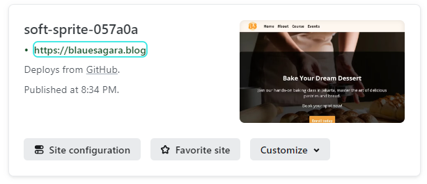

# Setup and Run

Website Link: [Bake Something](https://blauesagara.blog/)

Prerequisites:
- Github account
- VS Code
- Git bash

1. Clone project
    `$ git clone https://github.com/RevoU-FSSE-4/milestone-1-lilipertiwi.git`
2. Open a project in VS Code
3. Install Live Server extension
4. After installation, click to Go Live from the status bar to turn the server on/off.
   
5. Open a project and click to Go Live from the status bar to turn the server on/off.
   
6. OR use shortcut
   to open `Alt+L Alt+O` and to close `Alt+L Alt+C`

# Development Process

This website was inspired from sample projects, I use AI generator to prepare the text, and utilize the knowledge I learned from Week 0 - Week 4.

### 1. Initialize project structure
    - assets
      - css
        - style.css
      - images
        - favicon.ico
      - js
    - index.html
    - README.md
  
### 2. Add Header and Footer
   - Logo: generated from [favicon generator](https://favicon.io/favicon-generator/)
   - Font: [Madimi One from Google Fonts](https://fonts.google.com/specimen/Madimi+One)
   - Social media icon: [ion icons](https://ionic.io/ionicons)
   

### 3. Add and Styling Content
##### Content Header

##### About

##### Programs

##### Review

##### Gallery

##### Contact

### 4. Deploy to Cloud Server
Tutorial: https://lilipertiwi.github.io/Netlify/
